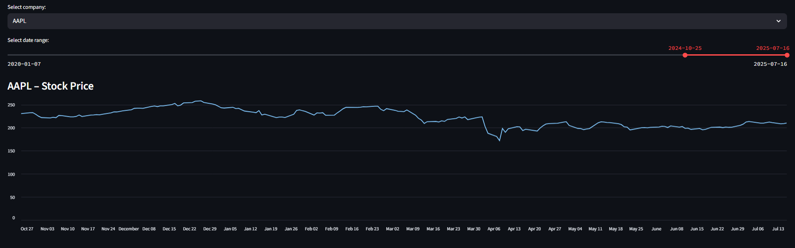
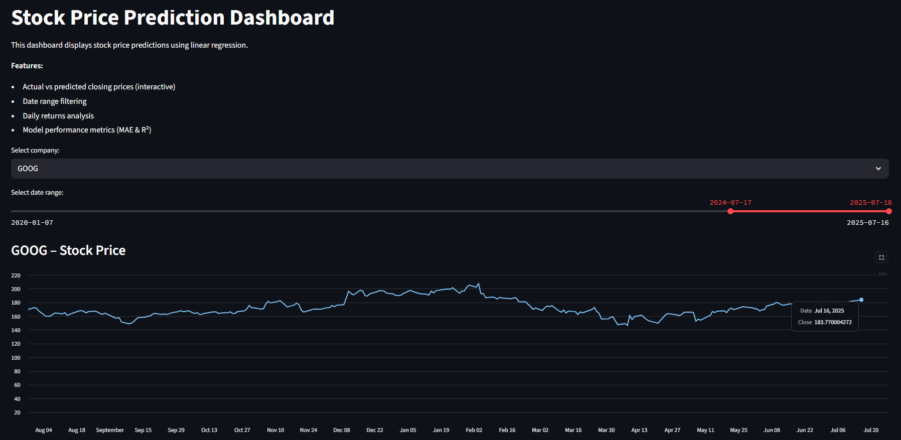
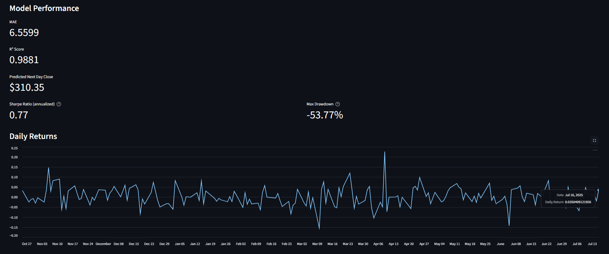
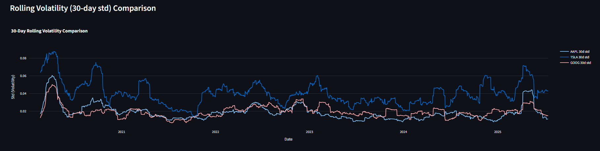
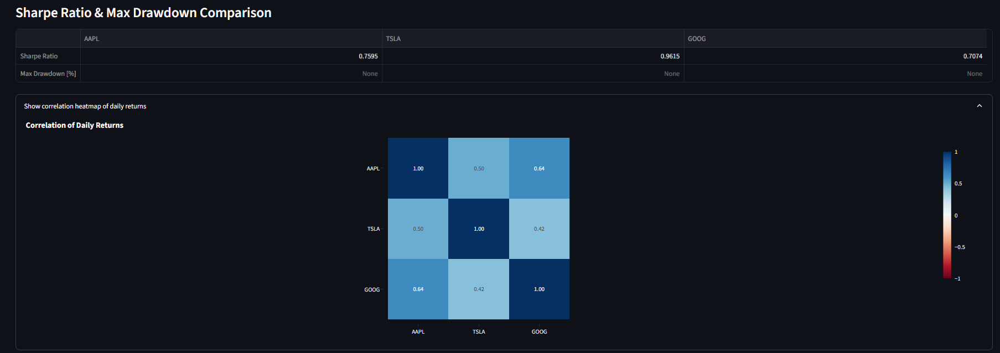

# Stock Price Prediction Dashboard

**First Interactive Data Science & Machine Learning Project**  
Predicting and visualizing stock prices for Apple (AAPL), Tesla (TSLA), and Google (GOOG) with Python, Streamlit, Pandas and scikit-learn.


````
## What’s Inside?

### **Data Analysis & Machine Learning**
- Data loading & cleaning for three stocks (AAPL, TSLA, GOOG)  
- **Exploratory Data Analysis (EDA):**
    - Daily returns (time series & histogram)
    - Price trends & rolling statistics
    - Correlation analysis between companies
- **Machine Learning:**  
    - **Linear Regression** model (scikit-learn) to predict the next day’s closing price
    - Model evaluation: MAE (Mean Absolute Error) & R² Score
    - Model performance comparison (bar charts & metrics table)
    - Prediction plots 
- **Financial metrics:**  
    - Sharpe Ratio 
    - Maximum Drawdown 

### **Interactive Dashboard (Streamlit)**
- Company selector (AAPL, TSLA, GOOG, ALL)
- Date range filter
- Interactive price plots (Plotly)
- Interactive prediction vs actual plot
- Interactive daily returns & histogram
- Comparison across all companies (model metrics, MAE, R², returns)
- Ready for screenshots or GIF recording 

---

## How to Run

1. **Clone the repository:**
    ```bash
    git clone https://github.com/jakubsmigielski/Prediction_Dashboard_FirstProject.git
    cd Prediction_Dashboard_FirstProject
    ```

2. **Install all dependencies:**
    ```bash
    pip install -r requirements.txt
    ```

3. **Run the Streamlit dashboard:**
    ```bash
    streamlit run streamlit_app.py
    ```


---

## Example Visualizations

Below are sample visualizations

---

### Dashboard Demo

*Preview of the interactive Streamlit dashboard. You can analyze different stocks, model predictions, performance metrics, and risk indicators in one place.*

---
Below some example charts
### Apple Stock Price (AAPL)



---

### Google Stock Price (GOOG)



---

### Model Performance



---

### Rolling Volatility



---

### Sharpe Ratio



---


---

## Scripts

- `fetch_data.py` — download/update stock data from Yahoo Finance
- `predict_aapl.py` — train and evaluate ML model for AAPL
- `predict_all.py` — train and evaluate for all companies
- `plot_all_predictions.py` — generate comparison plots
- `streamlit_app.py` — **main dashboard application**

---

## Used Tools & Libraries

- **Python 3.13**
- [Pandas](https://pandas.pydata.org/) – data analysis
- [NumPy](https://numpy.org/) – numerical operations
- [scikit-learn](https://scikit-learn.org/) – machine learning (LinearRegression, metrics)
- [Streamlit](https://streamlit.io/) – interactive dashboard
- [Plotly](https://plotly.com/python/) – interactive plots
- [Matplotlib](https://matplotlib.org/), [Seaborn](https://seaborn.pydata.org/) – classic charts
- [yfinance](https://github.com/ranaroussi/yfinance) – stock data fetching

---

## About

**Author:** [Jakub](https://github.com/jakubsmigielski)  
**educational project** 
**This project is for educational purposes only and **not** financial advice.**

---

